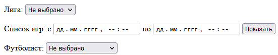
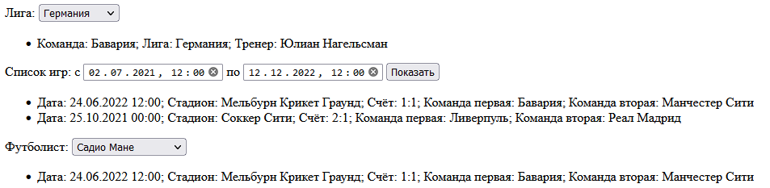

# Лабораторная работа №1 & №3

## Техническое задание
Вариант 7. Создать и заполнить произвольными данными БД для хранения информации о результатах футбольного чемпионата.

Для каждой футбольной команды задается такая информация: название, лига, главный тренер. Для каждой игры задается дата проведения, команды участницы, место проведения, финальный счет, участвующие футболисты.

Сформировать запросы и вывести результаты:

- таблица чемпионата выбранной лиги; 
- список игр на указанный временной интервал;
- список игр выбранного футболиста.


## Скрины

> Форма без данных
---

> Форма с данными
---
## Функция ассинхронного запроса
```javascript
const send = async function(data, text = false) {
    return await fetch('/controllers/Controller.php', {
        method: 'POST',
        headers: {
            'Content-Type': 'application/json'
        },
        body: JSON.stringify(data)
    })
        .then(response => { return text ? response.text() : response.json() });
}
```